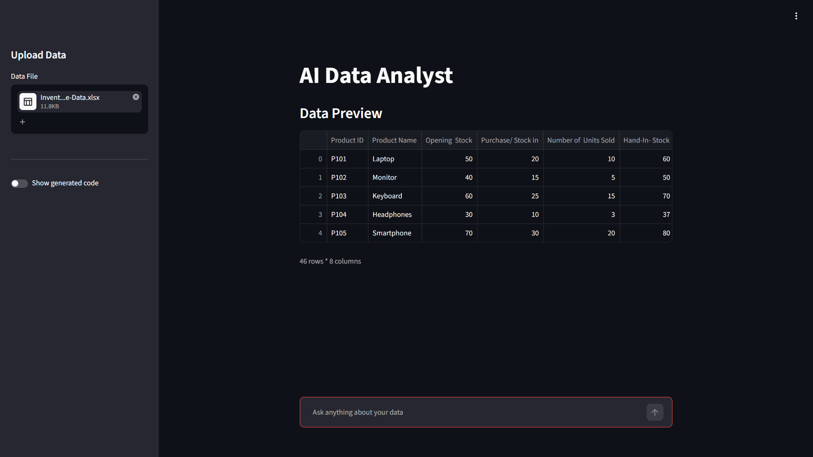
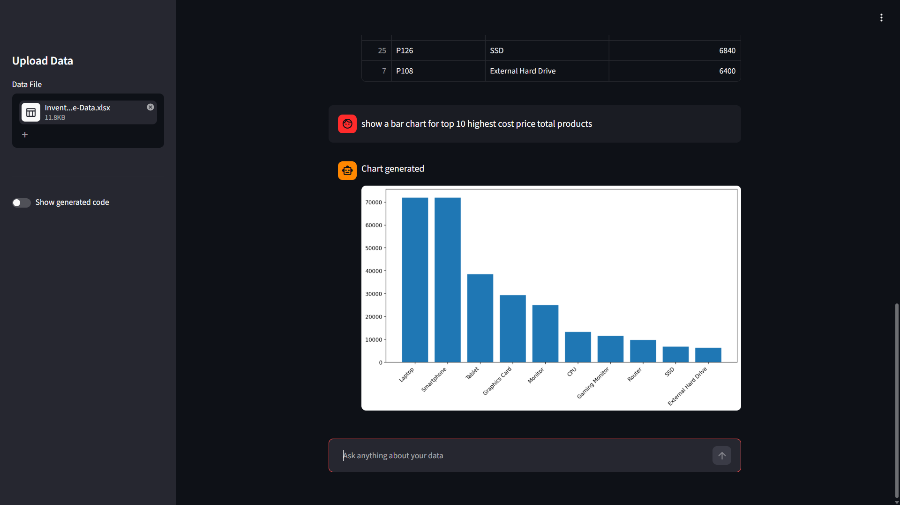
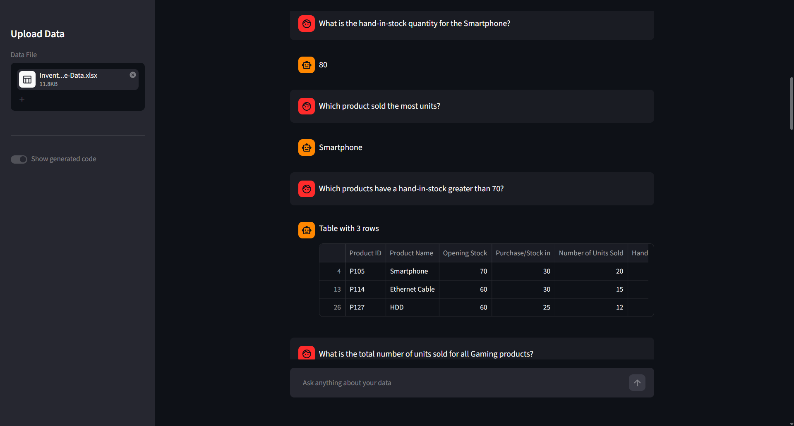

# 📊 AI Data Analyst

An AI data analyst agent with sandboxed code execution, 5-layer security, multi-format support, and auto-retry error recovery.

Upload a CSV/XSLX/TSV/XLS, ask questions in plain English — get answers, tables, and charts. No SQL, no formulas, no code required.

Powered by an AI agent that writes and executes pandas code in a sandboxed environment.

## How It Works

```
User uploads file → AI reads the data structure
User asks: "Which city had the most sales?"
  → AI writes pandas code
  → Code executes in a sandbox
  → Returns answer + chart (if asked/suited)
```

## Features

- **Natural language queries** — ask questions like you'd ask a colleague
- **Auto-generated charts** — matplotlib visualizations on demand
- **Secure code execution** — 5-layer sandbox prevents malicious operations
- **Any CSV |TSV |XLSX |XLS** — works with any tabular data

## Security

LLM-generated code runs in a restricted sandbox:
1. Dangerous keywords blocked (os, sys, subprocess, file operations)
2. Only safe builtins available (len, range, sum, etc.)
3. Only pandas, matplotlib, and the data accessible
4. DataFrame isolation — original data can't be modified
5. Exception handling — errors can't crash the app

## Tech Stack

| Component | Technology |
|-----------|-----------|
| UI | Streamlit |
| LLM | Groq |
| Data | Pandas |
| Charts | Matplotlib |
| Framework | LangChain |
| Deployment | Docker on HuggingFace Spaces |

# LIVE Demo Link
https://pragya6-ai-data-analyst.hf.space

## Screenshots
# Interface


# Generate Plots


# Ask Questions

